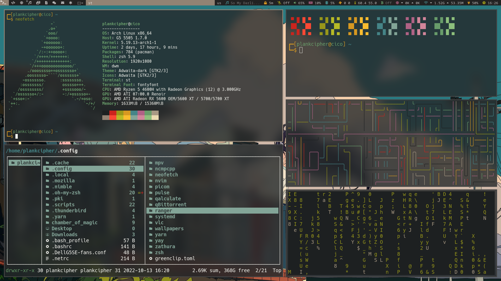
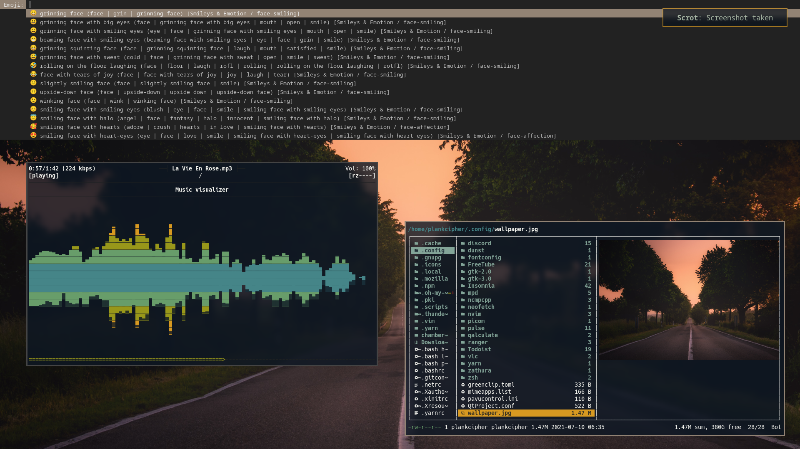
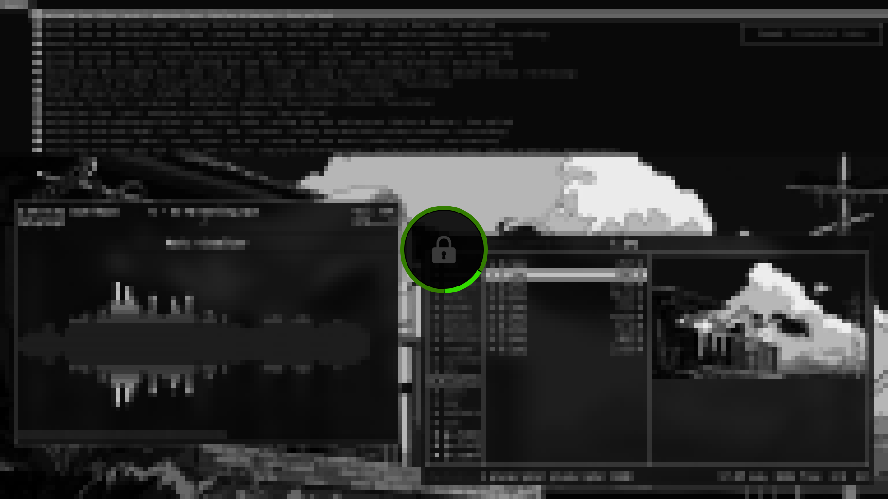
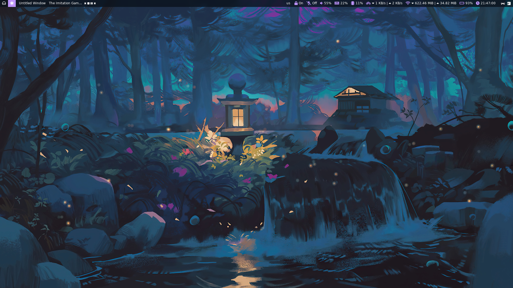
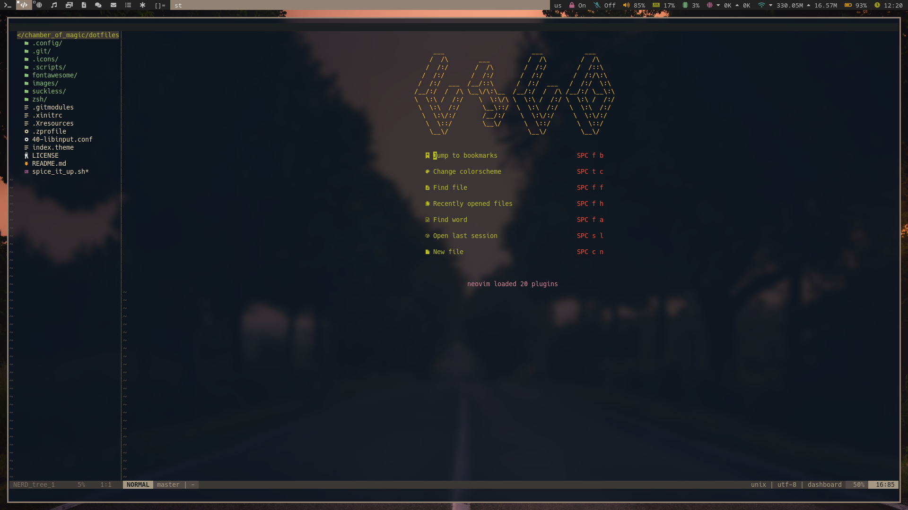
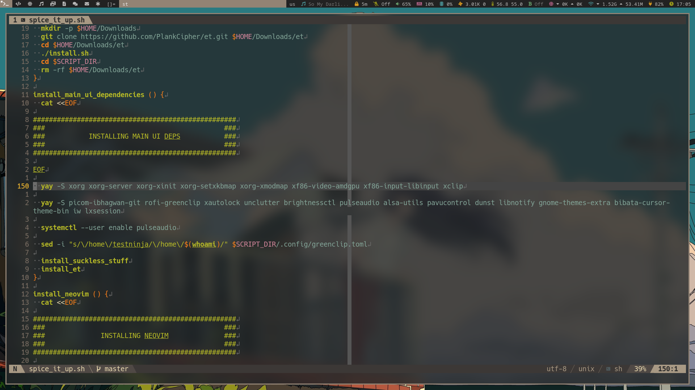

# My Arch Linux dotfiles

## Preview

## What's going on?!

- WM: [`dwm`](https://dwm.suckless.org)
- Screen lock: [`i3lock-fancy-multimonitor`](https://github.com/PlankCipher/i3lock-fancy-multimonitor)
- Compositor: [`ibhagwan's picom`](https://github.com/ibhagwan/picom)
- Application launcher: [`dmenu`](https://tools.suckless.org/dmenu)
- Terminal: [`st`](https://st.suckless.org)
- Shell: [`zsh`](https://www.zsh.org/) with [`Oh My Zsh`](https://ohmyz.sh/)
- Image viewer: [`feh`](https://wiki.archlinux.org/index.php/Feh)
- Video player: [`vlc`](https://wiki.archlinux.org/index.php/VLC_media_player)
- Music player: [`mpd`](https://wiki.archlinux.org/index.php/Music_Player_Daemon) and [`ncmpcpp`](https://wiki.archlinux.org/index.php/Ncmpcpp)
- Notifications: [`dunst`](https://wiki.archlinux.org/index.php/Dunst) and [`libnotify`](https://wiki.archlinux.org/index.php/Desktop_notifications#Libnotify)

## Installation

### Arch

Got you covered. Just clone this repo and run `spice_it_up.sh` on a fresh Arch install to get the exact same thing as me. It should theoretically work on a non-fresh install, but I did not test that out.

> **Note**: You may want to take a look at the script first.

### Non Arch

You can use the dotfiles, but not the installation script because it is made only for Arch, specially the dependencies part of it. I guess you can do the dependencies part on your own and reference the script for next steps.

## Usage

### Keybindings

These are almost all of the keybindings that were altered/added.

The keybindings are categorized into four categories: WM (default), Modifiers, Rofi, and Apps.

In all what follows:

- `$WM_MOD` refers to windows/meta/super
- `$MODIFIER_MOD` refers to meta + ctrl
- `$DMENU_MOD` refers to meta + shift
- `$APPS_MOD` refers to meta + alt
- `$WORKSPACES_MOD` refers to ctrl

| Keybinding                  | Usage                                          |
| --------------------------- | ---------------------------------------------- |
| $WM_MOD+k                   | Decreasingly cycle through clients stack       |
| $WM_MOD+j                   | Increasingly cycle through client stacks       |
| $WM_MOD+h                   | Decrease mfact (master window size)            |
| $WM_MOD+l                   | Increase mfact (master window size)            |
| $WM_MOD+Shift+j             | Move focused window down in the stack          |
| $WM_MOD+Shift+k             | Move focused window up in the stack            |
| $WM_MOD+d                   | Decrease number of masters                     |
| $WM_MOD+i                   | Increase number of masters                     |
| $WM_MOD+q                   | Kill focused window                            |
| $WM_MOD+Shift+Control+q     | Quit dwm                                       |
| $WM_MOD+f                   | Enter fullscreen mode for focused window       |
| $WM_MOD+u                   | Lock screen with `i3lock-fancy-multimonitor`   |
| $WM_MOD+space               | Change keyboard layout                         |
| $MODIFIER_MOD+plus          | Increase volume by 5%                          |
| $MODIFIER_MOD+minus         | Decrease volume by 5%                          |
| $MODIFIER_MOD+0             | Toggle volume                                  |
| $MODIFIER_MOD+Shift+0       | Toggle mic                                     |
| $MODIFIER_MOD+g             | Clear greenclip history (clipboard)            |
| $MODIFIER_MOD+less          | Play previous song                             |
| $MODIFIER_MOD+quotedbl      | Toggle songs                                   |
| $MODIFIER_MOD+greater       | Play next song                                 |
| $MODIFIER_MOD+u             | Toggle lockscreen timeout                      |
| $DMENU_MOD+a                | Launch dmenu_run                               |
| $DMENU_MOD+e                | Launch dmenu emoji picker                      |
| $DMENU_MOD+g                | Launch dmenu greenclip clipboard manager       |
| $DMENU_MOD+c                | Launch dmenu calculator                        |
| $DMENU_MOD+m                | Launch a dmenu to choose a song to play        |
| $DMENU_MOD+d                | Launch dmenu_et                                |
| $APPS_MOD+Return            | Launch terminal (i.e. `st`)                    |
| $APPS_MOD+b                 | Launch browser (i.e. `brave`)                  |
| $APPS_MOD+e                 | Launch file manager (i.e. `ranger`)            |
| $APPS_MOD+s                 | Launch screenshot tool (i.e. `scrot`)          |
| $APPS_MOD+m                 | Launch music player (i.e. `ncmpcpp`)           |
| $APPS_MOD+x                 | Launch XAMPP                                   |
| $APPS_MOD+t                 | Launch Todoist                                 |
| $APPS_MOD+f                 | Launch FreeTube                                |
| $WORKSPACES_MOD+[0-9]       | Switch to corresponding workspace              |
| $WORKSPACES_MOD+Shift+[0-9] | Move focused window to corresponding workspace |

### Workspaces

| number | what for                | windows that spawn there automatically            |
| :----: | ----------------------- | ------------------------------------------------- |
|   1    | general terminals stuff | none                                              |
|   2    | coding                  | none, but I usually spawn (Neo)Vim there manually |
|   3    | web browsing            | brave and Tor                                     |
|   4    | music players           | ncmpcpp                                           |
|   5    | other media (video...)  | vlc and FreeTube                                  |
|   6    | documents               | zathura, and libreoffice                          |
|   7    | discord                 | discord and Franz                                 |
|   8    | mail                    | thunderbird                                       |
|   9    | TODO stuff              | Todoist                                           |
|   0    | general                 | none                                              |
